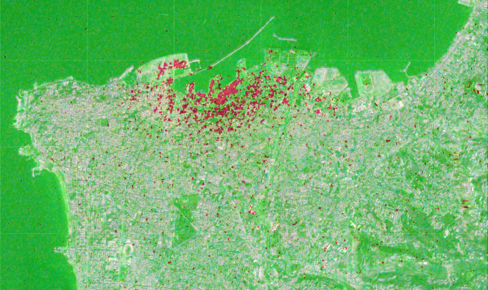
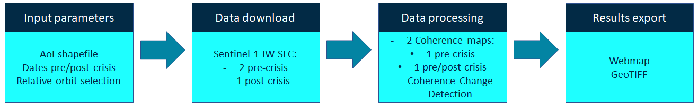

  

# Coherence Change Detection using Google Colab

  

***
The scope of this repository is to provide resources and examples to help you leverage SAR data using Coherence Change Detection using Google Colaboratory environment.
The usage of Synthetic Aperture Radar (SAR) data for Coherence Change Detection provides relevant information in phenomena with big changes, that could be consequence of natural or anthropogenic actions. Satellite remote sensing data is able to retrieve information from inaccessible or critical areas, even under cloud conditions, being an unvaluable tool for operational monitoring activities. 

The Jupyter Notebooks available for both study cases cover the installation of the necessary open tools (i.e. the ESA SentiNel Application Platform), the satellite data download (which requires previous user registration), interferometric coherence computation and post-processing steps, needed in some of the user input parameters, providing finally a Coherence Change map in an exportable webmap or GeoTIFF. These Jupyter Notebooks follow the workflow illustrated below, indicating, when the user input is needed. 

  

## Study cases - idenfitication of damage on urban infrastructure using Interferometric coherence

1. Explosion in Bata, Equatorial Guinea (03.07.2021) 
2. Explosion in Beirut, Lebanon (08.04.2020) 

## Requirements
- Google account
- Copernicus Open Data Hub or Alaska Satellite Facilities account
- Basic knowledge in (In)SAR data processing

## Learning material 
Here a non-exhaustive list of peer review publications covering the Coherence Change detection: 
 - [Coherence Change-Detection with Sentinel-1 for Natural and Anthropogenic Disaster Monitoring in Urban Areas](https://www.mdpi.com/2072-4292/10/7/1026)
 - [Urban Change Detection Using Coherence and Intensity Characteristics ofMulti-temporal ERS-1/2 Imagery](http://earth.esa.int/workshops/fringe2005/proceedings/papers/350_liao.pdf)
 - [Detection of landslide induced by large earthquake using InSAR coherence techniques – Northwest Zagros, Iran](https://www.sciencedirect.com/science/article/pii/S1110982318302886)

## Get started
- [Google Colaboratory](https://colab.research.google.com/notebooks/intro.ipynb)

Let us know if you have tried any of the solutions presented, we'd love to hear about your use cases!
 
