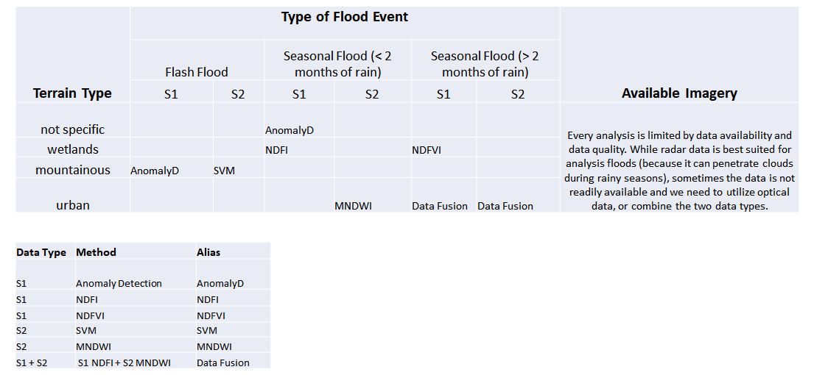

  

# Flood Analysis and Mapping using Google Earth Engine

***

The scope of this repository is to provide resources and examples to help you leverage SAR data for flood analysis and mapping using Google Earth Engine. The penetration of the microwave radar through the clouds makes radar satellite data an ideal choice for space flood mapping during rainy periods. Unfortunately, there is no "one fit all" solution for flood mapping using radar data. There are different indexes that can be utilized, suitable for certain topography or lengths of flood event. 

The Global Operational Support Team (GOST) of World Bank has been researching and testing different solutions on various use cases and developed a Decision Matrix (see PPT) with the hope that it will help you gest quick and accurate results for your analysis.

  

The scripts available here were developed in Google Earth Engine and contain a series of common elements, such as:

a) user input is clearly delimited and kept to a minimum: users need to change the AOI and date and can run the script

b) damage assessment analysis included in each script, which intersects the flood extent with WorldPop 2020 and with Copernicus Global Land Services (2019) to determine the number of people affected, the total ha of urban areas and cropland affected.

Some of the scripts developed are used for:
- Flood mapping using Sentinel-1 time series anomaly detection
- FloodMapping using Sentinel-2 and Modified Normalized Difference Water Index (MNDWI)
- FloodMapping using cloud mask Sentinel-2 and MNDWI 
- FloodMapping using Sentinel-1 Normalized Difference Flood Index (NDFI) and Normalised Difference Flood over short Vegetation Index (NDFVI) ([Cian,F. et al. 2018](https://doi.org/10.1016/j.rse.2018.03.006))
- FloodMapping using Sentinel-1 and the NDFI ([Cian,F. et al. 2018](https://doi.org/10.1016/j.rse.2018.03.006))
- FloodMapping using Sentinel-1 and Sentinel-2 data fusion from previous approaches
- FloodMapping using land cover classification using Support Vector Machines and Sentinel-2 data

## Requirements
- Google account
- Basic knowledge in SAR and Multi-Spectral data processing and applications

## Learning material 
Here a non-exhaustive list of peer review publications covering the surface water or flood detection using remote sensed satellite data: 
 - [Normalized Difference Flood Index for rapid flood mapping: Taking advantage of EO big data](https://doi.org/10.1016/j.rse.2018.03.006)
 - [Modification of normalised difference water index (NDWI) to enhance open water features in remotely sensed imagery](https://doi.org/10.1080/01431160600589179)

## Get started
- [Google Earth Engine](https://developers.google.com/earth-engine/tutorials/tutorials)

Let us know if you have tried any of the solutions presented, we'd love to hear about your use cases!
 
