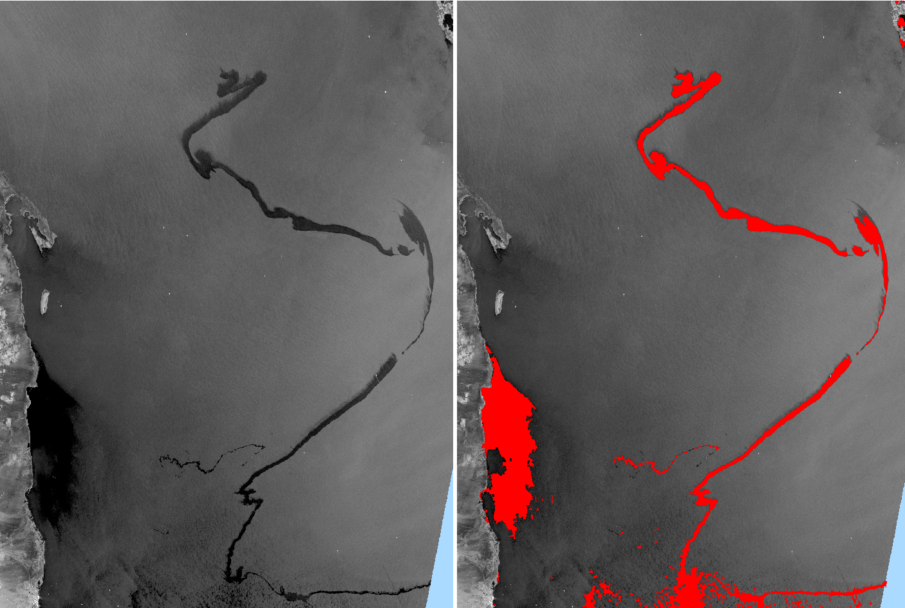
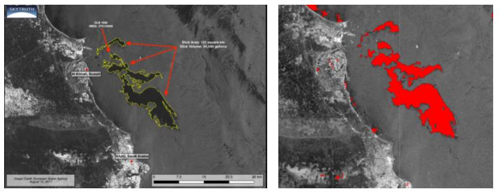
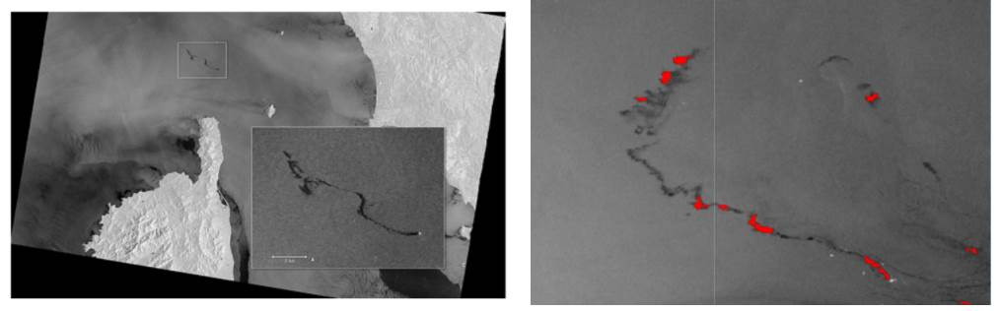
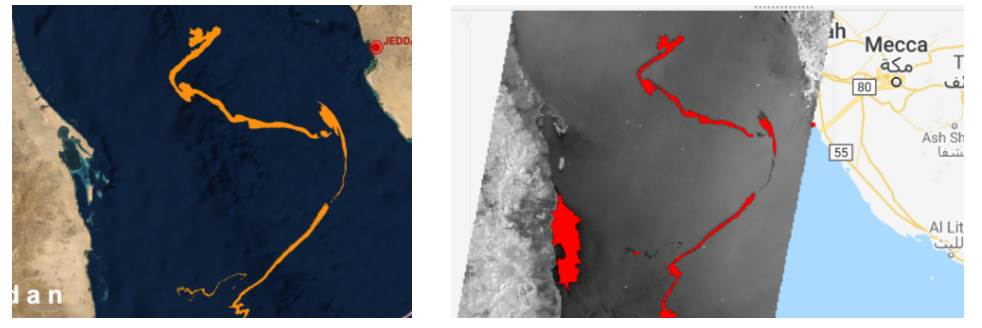

  

# Oil Spill Detection using Google Earth Engine

## Background
Oil spills are not static and therefore are difficult to monitor due to the transformation that takes place, from minute to minute, due to external environmental factors: **spreading | evaporation | dispersion | emulsification| dissolution | oxidation | sedimentation | biodegradation**.

More information, from the paper [An assessment of oil spill detection using Sentinel 1 SAR-C images](https://www.sciencedirect.com/science/article/pii/S2468013319301494), below:

_Identification of an oil spill is essential to evaluate the potential spread and float from the source to the adjacent coastal terrains.  SAR operability for oil slick discovery is wind speed restricted. A low wind speed won't deliver the portrayed complexity as the outcome of the nonattendance of wind-driven ocean narrow waves. In high wind speed condition, oil surface damping decreases as increment the vitality of ocean waves with oil beginning to get blended with waves. As soon as the oil is spilt, it begins promptly to spread against the ocean surface. The more unpredictable segments of oil will dissipate to the environment. The rate of dissipation relies upon surrounding temperatures and wind speed. The rate of scattering is generally needy upon the idea of the oil and the ocean state, continuing most quickly with low consistency oils within the sight of breaking waves. Waves and choppiness at the ocean surface can make all or part of a smooth separation into beads of fluctuating sizes which become blended into the upper layers of the water segment. Many oils take up water and structure water-in-oil emulsions. This can expand the volume of contamination by a factor of up to multiple times. Oil droplets can associate with sediments particles and natural issue suspended in the water segment so the beads become thick enough to sink gradually to the ocean. Sedimentation is one of the key long-haul procedures prompting the gathering of spilt oil in the marine condition._

An ilustrative example of this application is the analysis of the oil spill extent occured in the Red Sea in October 2018. In red colour the area affected by a significant drop of the coherence values before and after the explosion event.

  

***
The scope of this repository is to provide resources and examples to help you leverage SAR data using Anomaly Detection approach using Google Earth Engine for oil spill detection.
The usage of Synthetic Aperture Radar (SAR) data for Coherence Change Detection provides relevant information in phenomena with big changes, that could be consequence of natural or anthropogenic actions. Satellite remote sensing data is able to retrieve information from inaccessible or critical areas, even under cloud conditions, being an unvaluable tool for operational monitoring activities. 

The developed GEE code indicates where the user input is needed. 

## Study cases - idenfitication of oil spill using anomaly detection time series of Sentinel-1 data
GOST has tested the Anomaly Detection script for detecting Oil Spills, using 3 known events:
1. Kuwait oil spill (10.08.2017). [info](https://i0.wp.com/skytruth.org/wp-content/uploads/2017/08/Kuwait_2017-08-10_a.png?w=3000&ssl=1)

  

2. Corsica oil spill (07.10.2018 - 10.10.2018) [info](https://www.cmcc.it/article/corsica-oil-spill-in-october-2018-the-cmcc-delivered-5-pollution-forecast-bulletins)

  

3. Red Sea oil spill (13.10.2019) [info](http://beyond-eocenter.eu/index.php/news-events/193-oil-spill-extent-mapping-in-the-red-sea)

  

All use cases can be analysed using one sigle code. [GOST code](https://code.earthengine.google.com/7a4ae146c600fda75b31b440b9dd353b)

## Requirements
- Google account
- Basic knowledge in SAR data processing

## Learning material 
Here a non-exhaustive list of peer review publications covering the oil spill detection: 
- [An assessment of oil spill detection using Sentinel 1 SAR-C images](https://www.sciencedirect.com/science/article/pii/S2468013319301494)
- [Analysis of Sentinel-1 marine applications potential](https://doi.org/10.1109/IGARSS.2012.6351187)
- [Mapping Oil Spill Using Sentinel-1: Study Case of Karawang Oil Spill](https://iopscience.iop.org/article/10.1088/1755-1315/698/1/012019/pdf)
- [Oil Spill Detection Based on Deep Convolutional Neural Networks using Polarimetric Scattering Information from Sentinel-1 SAR Images](https://doi.org/10.1109/TGRS.2021.3126175)
## Get started
- [Google Earth Engine](https://earthengine.google.com)
