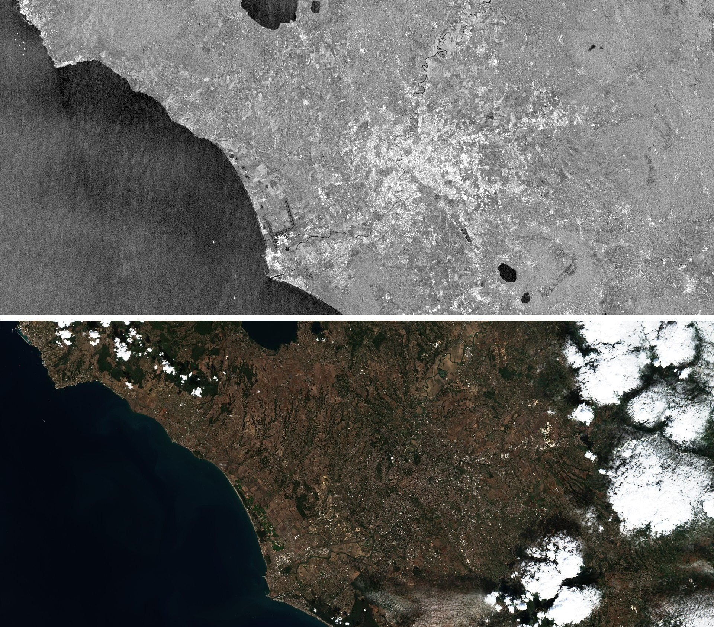

  

# SAR applications

This repository contains resources and examples to help you leverage SAR data (and optical data) for various mapping applications, in Google Earth Engine and Google COLAB. 
SAR systems, contrary to optical systems, do not depend on natural ilumination and it is able to penetrate clouds, being able to provide weather independent data. More information about SAR image formation and SAR satellite data and applications can be found in [here](https://www.esa.int/esapub/tm/tm19/TM-19_ptA.pdf) 

The ilustration below shows an example of SAR (gray) and an optical (true color RGB) satellite images acquired over Rome metropolitan area (Contains Copernicus Sentinel-1 and Sentinel-2 data [2021]).  

  

## Resources

1. [Flood analysis and mapping](https://github.com/mdelgadoblasco/GOST_SAR/tree/master/Flood%20Analysis%20and%20Mapping)
 - guidance for choosing the appropriate methodology to map flood extent
 - GEE scripts for flood mapping and damage assessment using S1 radar data and S2 optical data
 - COLAB script for cloud masking and flood mapping using S2 optical data
 
2. [Coherence change detection](https://github.com/mdelgadoblasco/GOST_SAR/tree/master/Coherence%20Change%20Detection)
 - COLAB scripts using S1 data

3. [Oil spill detection](https://github.com/mdelgadoblasco/GOST_SAR/tree/master/Oil%20Spill)
 - GEE script
 
4. [Volcano eruption](https://github.com/mdelgadoblasco/GOST_SAR/tree/master/Volcano%20Eruption)
 - GEE script
 - COLAB script 
 
## Get started

- [Google Earth Engine](https://earthengine.google.com)
    >
- [Google COLAB](https://colab.research.google.com/notebooks/intro.ipynb)
    > 
Let us know if you have tried any of the solutions presented, we'd love to hear about your use cases!

## Disclaimer
The code available in this repository may produce results containing geographic information with limitations due to the scale, resolution, date and interpretation of the original source materials. No liability concerning the content or the use thereof is assumed by the producer.

The Global Operational Support Team, DECAT, The World Bank.
