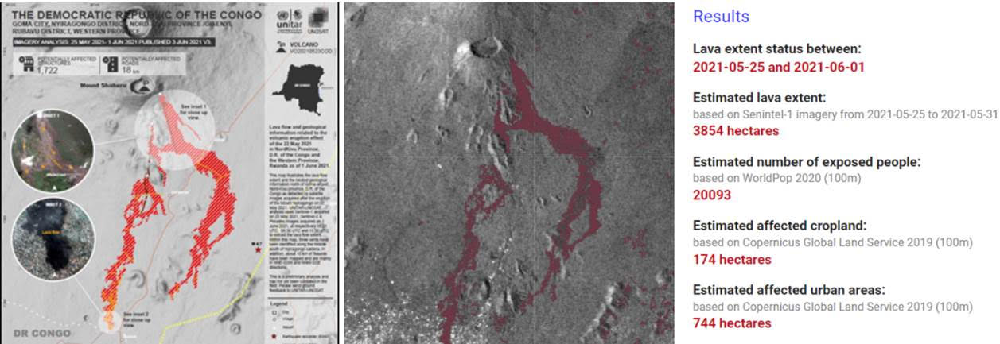

  

# Lava flow detection using time series anomaly detection on Google Earth Engine
An ilustrative example of this application is the lava flow detection after the eruption of the Mount Nyiragongo ocurred on 22 May 2021. Using our scripts, it is possible to perform a quick damage assessment. In red colour the area detected as lava using Copernicus Sentinel-1 data, using our anomaly detection algorith which takes the advantage of analysing large time series of data.

More information about the lava flow mapping of UNITAR is available [here](https://unitar.org/maps/map/3300)

  

This image above puts together the UNITAR map and the results obtained using our approach, showing a strong agreement between both. 

***
The scope of this repository is to provide resources and examples to help you leverage SAR data for Lava flow using our anomaly detection method developed on Google Earth Engine.
The usage of Synthetic Aperture Radar (SAR) data for Anomaly Detection provides relevant information in phenomena with big changes, that could be consequence of natural or anthropogenic actions. 

The GEE code available for this application, as it is based on anomaly detection can be employed also for analysing other type of phenomena, such as floods or oil spills, as far as these can be considered an anomaly. The code has an initial section indicating the user inputs that are needed, and the suggested parameters had been selected to be appropriate with this kind of phenomenom. 

## Study cases - idenfitication of damage caused by the lava flow using anomaly detection time series of Sentinel-1 data

1. Nyiaragongo eruption, DR Congo, May 2021 [GEE code](https://github.com/mdelgadoblasco/GOST_SAR/blob/master/Volcano%20Eruption/code/Volcano%20Erruption.js)

## Requirements
- Google account
- Basic knowledge in (In)SAR data processing

## Learning material 
Here a non-exhaustive list of peer review publications covering the Anomaly Detection using Copernicus Sentinel-1 data: 
 - [Detection of soil moisture anomalies based on Sentinel-1](https://ui.adsabs.harvard.edu/link_gateway/2019PCE...112...75G/doi:10.1016/j.pce.2018.11.009)
## Get started
- [Google Earth Engine](https://colab.research.google.com/notebooks/intro.ipynb)

